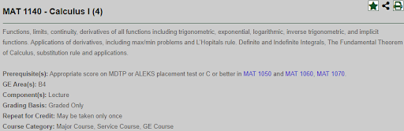
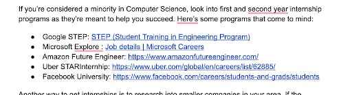
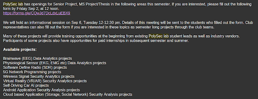

# The Playbook for CS Majors

The goal for this playbook is for us (extremeways#0103 and ZombiMigz#6758) to provide YOU with the advice and guidance to help you succeed in your career. We will try to update this document often, but as always, do your own research. If you have any suggestions please let us know/comment.

**This document is not a definitive/official guide to CalPoly Pomona and that the authors are not responsible for any inaccuracies in the print; readers should refer to official sources from the school for the most up to date information.**

# Intro to College {#intro-to-college}

Being in college is daunting. All of the freedom and responsibility is yours to balance. Things are moving at a fast pace, and with assignments and responsibilities, it is stressful to juggle everything. Regardless of wherever you are in your journey at Cal Poly Pomona/college, these tips will help you succeed in getting an internship/progressing in your career. If you are a freshman, it DOES NOT mean you have a lot of time. You seriously don’t. Do not get complacent - 4 years goes by very quickly. Implementing this playbook early will give you a great advantage and set you up for future success. If you are a senior, that means you have much less time. Following this playbook is imperative in landing a new grad role.

First off, in order to survive, you will have to learn how to prioritize and manage your time effectively. You will also need to ensure that you are mentally well for the journey ahead. This means you will have to either make time or find time to fulfill your responsibilities. Remember that you are a human, and not a robot; you cannot work 24/7 - you will burn out and things will quickly spiral out of control. Also remember that college is a marathon, not a sprint. You need to have a way to manage your stress, whether it be video games, physical activity, etc. You are a student first - ensuring that you graduate with a good GPA is one of the most important things. Create a flexible schedule that allows you to get your work done and still have some time for yourself. Once you have a SUSTAINABLE and HEALTHY schedule, you can move on.

Before starting, we want you to keep a couple things in mind. Most importantly, ask yourself **“Why?” every step of the way. **Why does it make sense to pursue an internship (or whatever goal you have)? What do you gain from it? For every question, ask yourself “Why?” 5 times. Once you can honestly answer “Why?” each time, you can work backwards and map out a clear road to progress. Make sure that you can answer the 5 W’s (who, what, when, why, where) and how you can achieve each step. Answer each question truthfully, because you don’t want to end up in a role that you don’t enjoy.

# Course Planning {#course-planning}

Course planning is a somewhat complicated process. My recommendation is to do your research the summer before or during your first semester. Once you’ve done your planning you shouldn’t have to make any major changes in the future. Note that this applies to all majors, not just CS.

## Template {#template}

For those of you who need a starting point, here is my recommended template. There is less than a 1% chance you will be able to follow this plan due to time conflicts, bad professors, etc. Obviously if you’re transferring in or have some AP/IB/dual enrollment credits, you can get rid of the courses you’ve already finished. Also note that requirements may be different depending on what year you’re coming in, double check to see if you still need to take a class or if there is a class not in this template. Modify it to your needs.

<table>
  <tr>
   <td>Fall 1(15)
   </td>
   <td>Spring 1(17)
   </td>
   <td>Fall 2(15)
   </td>
   <td>Spring 2(15)
   </td>
   <td>Fall 3(16)
   </td>
   <td>Spring 3(15)
   </td>
   <td>Fall 4(13)
   </td>
   <td>Spring 4(15)
   </td>
  </tr>
  <tr>
   <td>MAT1140(4)
   </td>
   <td>CS2400(4)
   </td>
   <td>STA2260(3)
   </td>
   <td>CS3310(3)
   </td>
   <td>CS3650(4)
   </td>
   <td>CS3010(3)
   </td>
   <td>CS4310(3)
   </td>
   <td>CS4800(3)
   </td>
  </tr>
  <tr>
   <td>CS1400(4)
   </td>
   <td>MAT1150(4)
   </td>
   <td>CS2640(3)
   </td>
   <td>CS3560(3)
   </td>
   <td>CS3750(3)
   </td>
   <td>Elective(3)
   </td>
   <td>CS4630(1)
   </td>
   <td>Elective(3)
   </td>
  </tr>
  <tr>
   <td>CS1300(3)
   </td>
   <td>CS2600(3)
   </td>
   <td>Elective(3)
   </td>
   <td>CS2610(3)
   </td>
   <td>CS3110(3)
   </td>
   <td>Elective(3)
   </td>
   <td>Elective(3)
   </td>
   <td>CS4080(3)
   </td>
  </tr>
  <tr>
   <td>PHY1510(3)
   </td>
   <td>GE A2(3)
   </td>
   <td>Elective(3)
   </td>
   <td>GE A3(3)
   </td>
   <td>GE C2(3)
   </td>
   <td>GE C1/C2(3)
   </td>
   <td>GE F(3)
   </td>
   <td>GE E(3)
   </td>
  </tr>
  <tr>
   <td>PHY1510L(1)
   </td>
   <td>BIO1110(2)
   </td>
   <td>GE A1(3)
   </td>
   <td>GE C1(3)
   </td>
   <td>GE D1(3)
   </td>
   <td>GE D2(3)
   </td>
   <td>B5/D4(3)
   </td>
   <td>C3(3)
   </td>
  </tr>
  <tr>
   <td>
   </td>
   <td>BIO1110L(1)
   </td>
   <td>
   </td>
   <td>
   </td>
   <td>
   </td>
   <td>
   </td>
   <td>
   </td>
   <td>
   </td>
  </tr>
</table>

_\* The courses at the top are more important_

## Some Terminology {#some-terminology}

To be able to understand what I’m talking about you’ll have to learn some vocabulary. Feel free to consult the glossary at the bottom if you forget what something means. We’ll use an example course, "Mat1140 - Calculus I (4)" as an example:

Course Subject - The subject/department that manages this course (i.e. MAT, which is short for Math) \
Course Number - The number for this course (i.e. 1140) \
Course Title - Name of the course (i.e. Calculus I) \
Units/Credits - How many “points” you get for taking this course \
Prerequisites - What classes/requirements you need before taking this course \
GE Area - The General Education Category this course covers if it does at all \
Lower Division - 1000/2000 level courses (i.e. MAT1140 and CS2400 are lower div courses) \
Upper Division - 3000/4000 level courses (i.e. CS3310 and CS4800 are upper div courses) \
Graduate Level - 5000/6000 level courses \

## Which courses do I need to take? {#which-courses-do-i-need-to-take}

Every academic year has a different set of required courses. When searching for your requirements, you need to make sure the selected academic year is correct. We’ll try to update this list as often as possible, but otherwise refer to: [https://catalog.cpp.edu/](https://catalog.cpp.edu/)

2022-2023: [CS Courses](https://catalog.cpp.edu/preview_program.php?catoid=61&poid=15916&returnto=4876) [General Education](https://catalog.cpp.edu/preview_program.php?catoid=61&poid=15936) \

2021-2022: [CS Courses](https://catalog.cpp.edu/preview_program.php?catoid=57&poid=14892&returnto=4359) [General Education](https://catalog.cpp.edu/preview_program.php?catoid=57&poid=14912)

## Types of Courses {#types-of-courses}

There are 3 different sets of courses you will need to take to get your degree.

### Major Required {#major-required}

These are courses that every CS major must take. Generally these are the most important ones since you have less flexibility with them.

### Major Electives {#major-electives}

Like it sounds, these are courses you get to pick. The only requirement is that you take a certain number(units) of them. The number of units required changes depending on the academic year. For example, 2022-2023 requires 17 elective units, which could be fulfilled by 5x3 unit classes and 1x2 unit class.

There are 3 different kinds of electives: Standard electives, lower division electives, and “special” electives. Lower division electives are made for freshmen/sophomores and tend to be easier. Special electives include internship credits, projects, and special study. While you can take only standard electives to fill your requirements, you have the option of taking a limited number of lower division electives and some special electives.

I recommend prioritizing electives LAST, as you can take them more or less whenever. For most people I’d recommend taking as many lower div electives as you’re allowed (currently 2). If you can get one of the special electives whether it be through a senior project, getting an internship, etc, definitely take it. They’re more valuable than standard electives but not absolutely necessary.

### General Education (GE) {#general-education-ge}

Every student regardless of major must complete their general education. General Education is broken up into a few sections/subsections by letters and numbers, each representing a different requirement. For example, B4 is “Mathematics/Quantitative Reasoning”, and can be completed by taking a mathematics course such as MAT1140 - Calculus I. Note that a course CAN be used to fulfill both a major course and GE courses. However, one course CANNOT fulfill two GE courses. GE courses are for the most part easier than your major required courses, and will require virtually no previous knowledge, given that you pick a decent professor.

General education shouldn’t be prioritized over major required courses. They should be split evenly across your four years. DO NOT take them all at the beginning, as you need these easier GEs to balance out your more difficult major courses in your later years.

#### Synthesis Courses (Upper Division GE) {#synthesis-courses-upper-division-ge}

There is a special type of GE known as a synthesis or an upper div GE. These are slightly harder (but still easy) courses to finish off a “category” of GE. For example, B5 is taken after completing all of B1-4, and can be covered by a more advanced science/mathematics course. Same applies for C3 and D4.

# Registration {#registration}

Knowing when/how to register for classes is VERY important. You don’t want to end up with bad classes, or worse, no classes at all.

## When do I register for classes? {#when-do-i-register-for-classes}

Registration occurs a few months before every term/semester. You can find the dates [here](https://www.cpp.edu/academicplanning/academic-calendar/index.shtml).

## Priority Registration {#priority-registration}

Basically, priority registration lets you pick classes before everyone else. In CS, due to it being an overpopulated major, you should always get priority registration if you can.

The most common way to do this is through the [2/4-year promise program](https://www.cpp.edu/studentsuccess/oss/graduation-pledge/4-year-ca-promise-info.shtml). For this program you **MUST** enroll in the first semester you attend CPP. The main issue with the promise program is that you need to be either a first-generation student, receive pell-grant(FAFSA), or be from a low-income highschool.

There are other ways to get priority registration such as disabilities or sports, but they are more niche.

## Registration Periods {#registration-periods}

There are different points in which you may register for courses.

### Priority Registration {#priority-registration}

This is when people who have priority registration such as those signed up to the 4-year promise or those who are graduating get to pick classes. You can get in virtually any class during this time.

### General Registration {#general-registration}

This is when most of the school registers for classes.

#### How are General Registration Dates Decided? {#how-are-general-registration-dates-decided}

This is dependent on how many units you have completed in your degree. For example, juniors with 81 units register before freshmen with 15 units completed. There is no way to circumvent this system besides completing more units.

### Orientation Registration {#orientation-registration}

This only applies for the first time you register for courses, which will be done during an orientation session with your peers. For this reason, we recommend getting the earliest possible orientation time, as you’ll get first pick over your peers.

### Add/Drop Period {#add-drop-period}

This starts 2 weeks before classes begin and ends 2 weeks after classes begin. During this time, you may drop out or add a new class to your schedule for that semester with no penalty. Your unit cap also increases from 16 to 18 at this point.

## How many units can I register for? {#how-many-units-can-i-register-for}

You can register for up to 16 units before add/drop. During add/drop you can register for up to 18.

## Petitioning Unit Cap {#petitioning-unit-cap}

You can petition the unit cap during add/drop [here](https://polyform.cpp.edu/Loginformproc/UnityForm.aspx?d1=AfmRYlBLr2F0TtRi5WMsu34OwPYGoSBC77j8hfc9fslGQC3uFHzWfUaIbJo%2fCo1jMjWVwzyGiZUNtGWJOyU1IMxiIEn6GTT2vZghLsgIvH6OkVixsPpeHcuSirJ6vfhfud7xmgrGxjw0eA0%2bgkkEw3tU97eCoJoZg4%2bLrI2NE3GqZWSAhjkYBmXHq17etgu1EGvi6gypIsgCpbMjOQfNL9jhmwc2rQx6JAfED%2fIYGsbkv9tulfYr%2bGPoFR4toyjfHw%3d%3d). In my experience the department is quite lenient with this. I recommend emailing the department chair if you plan on doing this, and have a good reason why you want to exceed the unit cap (i.e. graduating on time).

## Intersessions {#intersessions}

Note that you can take courses over the summer/winter. This is not required or common, but can be very helpful if you want to finish your degree earlier or lighten your courseload during the year.

### Winter {#winter}

Winter lasts 4 weeks, meaning any course you take will be at 4x speed compared to a regular semester. In other words, taking 1 winter course will be as much work as taking 4 courses. Note that some if not most professors make the classes easier for the shortened time period, this is not a guarantee but a good thing to keep in mind. One such course is CS4990-AWS, which is roughly the pace of a regular class during the spring/fal). Do NOT overwork yourself. There are a VERY limited number of courses you can take during the intersession and you can only take up to 6 units (unless you petition to take more). Note that there is NO financial aid during the winter, any courses you take will be out of pocket. Expect to pay >$1000 for 1 course and >$2000 for 2 courses.

### Summer {#summer}

There are a few different type of summer courses. 5-week and 10-week courses. 5-week courses will be roughly 3x pace in comparison to during the semester. There are two 5-week sessions for the first half of the summer and second half of the summer. Courses are offered in both, make sure to check which session your section is in. 10-week courses will be easier at 1.5x pace. You may only take 12 units (unless you petition to take more) There is financial aid available if you take at least 6 units.

# **Glossary** {#glossary}

<table>
  <tr>
   <td>Academic Year
   </td>
   <td>The year you joined Calpoly Pomona.
   </td>
  </tr>
  <tr>
   <td>Course Number
   </td>
   <td>The number for the course (i.e. 1140)
   </td>
  </tr>
  <tr>
   <td>Course Title
   </td>
   <td>Name of the course (i.e. Calculus I)
   </td>
  </tr>
  <tr>
   <td>CPP
   </td>
   <td>Abbreviation for California State Polytechnic University - Pomona, CalPoly Pomona
   </td>
  </tr>
  <tr>
   <td>GE
   </td>
   <td>Abbreviation for General Education
   </td>
  </tr>
  <tr>
   <td>GE Area
   </td>
   <td>The category of General Education that everyone needs to complete to graduate
   </td>
  </tr>
  <tr>
   <td>Lower Division
   </td>
   <td>1000/2000 level courses
   </td>
  </tr>
  <tr>
   <td>Lower Division
   </td>
   <td>1000/2000 level courses made for freshmen/sophomores
   </td>
  </tr>
  <tr>
   <td>Prerequisites
   </td>
   <td>The courses/requirements you need before taking the course
   </td>
  </tr>
  <tr>
   <td>Section
   </td>
   <td>A course taught in a specific semester by a professor in a given location/time
   </td>
  </tr>
  <tr>
   <td>Subject
   </td>
   <td>The subject/department that manages the course (i.e. MAT)
   </td>
  </tr>
  <tr>
   <td>Unit Cap
   </td>
   <td>The maximum units you can register for during a certain period.
   </td>
  </tr>
  <tr>
   <td>Units/Credits
   </td>
   <td>Number of “points” you get from finishing the course
   </td>
  </tr>
  <tr>
   <td>Upper Division
   </td>
   <td>3000/4000 level courses made for juniors/seniors
   </td>
  </tr>
</table>

Alright, now that you know what classes to take and when to take them, let's move onto working on your career. Get a pen and paper. Every time you see a question, write out your **honest, in-depth **answers.

Again, we will put this here. We really want you to think everything through:

Before starting, we want you to keep a couple things in mind. Most importantly, ask yourself **“Why?” every step of the way. **Why does it make sense to pursue an internship (or whatever goal you have)? What do you gain from it? For every question, ask yourself “Why?” 5 times. Once you can honestly answer “Why?” each time, you can work backwards and map out a clear road to progress. Make sure that you can answer the 5 W’s (who, what, when, why, where) and how you can achieve each step. Answer each question truthfully, because you don’t want to end up in a role that you don’t enjoy.

- Build relationships (this is the first bullet point for a reason - it’s the most important)
  - If you don’t know how to network and you want a job, you’re going to have to learn to network. In your quest for a career, you’ll find that typically it is not WHAT you know, but rather WHO you know that will help you land what you seek.
  - People, people, people. People are your friends. If you just talk with someone, you can build a relationship with people. Some of these people might become your best friends! You get to hear about their experiences, their advice, their mistakes and form a deeper bond with them. They can also help you with your job search (getting your foot in the door, etc.).
    - **NOTE: if you are fortunate enough to have multiple opportunities, pass it on. Help somebody else out - if you know somebody that has been searching for an opportunity, and you know that you’re not going to be taking one of the roles that you have been offered, you can (and should) refer that person to that recruiter. Pass the recruiter their contact information, LinkedIn, resume, etc. Obviously, ask that party if they would like the role first, and if so, refer them. **
  - Talk to people outside of your major. They often have different perspectives, different experiences, know more people, etc. You don’t want to be insulated inside of the CS bubble - get out there and talk to people. They may become your closest friends.
  - Building soft skills and being able to talk about who you are and what you have done are just as important as hard skills. Nobody wants to work with somebody that can’t communicate or is hard to work with - think of group projects. Being like that is a great way to get fired/kicked off of a team.
  - You want to have an elevator pitch - imagine you have 1 minute to talk to somebody you just met. Tell them who you are, what your skills are and what you do, **quickly. **Here’s a link: [https://www.thebalancemoney.com/elevator-speech-examples-and-writing-tips-2061976](https://www.thebalancemoney.com/elevator-speech-examples-and-writing-tips-2061976)
  - You want to have that elevator pitch before you go to these events. You don’t want to create a bad first impression by stumbling over words or not even knowing what you’re going to talk about.
  - A great way to build relationships is** in person.** Do your research and find conferences, events and meet-ups that you’re interested in. Examples include the CPP Career Fairs, DEFCON, clubs on campus, professional events like ISACA, (they usually give student discounts and have INDUSTRY PROFESSIONALS there), etc. Ask your friends, professors, and more about where they go to meet people in the industry.
  - When you get to the event, talk to **everybody. **You never know who you’ll meet. It might be difficult if you’re shy, but look - anything worth getting is always going to be a challenge. Walk up to people and introduce yourself to them. Ask them who they are, what they do. Talk about yourself - don’t try to push them for a referral too early. You want to build a professional relationship by getting to know each other and making a good impression.
  - At the end of the conversation, GET THEIR CONTACT INFORMATION (email, LinkedIn). You want to keep in contact with these people - you never know when you need someone’s contact. Immediately message them thanking them for talking to you at the “x event” and that you look forward to speaking with them again. Rinse and repeat.
  - So now you have people’s contact information - if you ever need a referral, or are applying to something, you have your foot in the door. That person might be the key to get you past the HR filter (bypassing a lot of applicants) and putting you at the top of the interview stack.Much better than fighting against 10000 applicants, right?
- Where are you at right now (in terms of graduation level)?
  - If you are closer to graduation (junior/senior), then it is even more important to land an internship. You have 1-2 years to find yourself a job upon graduation. If you are a freshman/sophomore, that DOES NOT mean you can slack off - you still have to apply for positions. **NOTE: Freshman internships are NOT the norm and you don’t have to panic yet - however, you should be aware of them. There are specialized internships SPECIFICALLY for freshmen/sophomores like: **

_The above image is a repost from CPP CS discord_

- Don’t limit yourself to looking for summer internships. Look how long the year is. You have Spring, Summer and Fall (potentially Winter) to find an internship. If you have 2 years left, you have (potentially) 6 internships you can get. Do not be afraid to take a gap semester, the extra money you’ll earn back from the added experience is 100% worth graduating a semester or two later.
- Take time for yourself - if you need to take a gap semester/time off, don’t feel bad about it. However - check the amount of time off that the school offers students for breaks beforehand.

  - [https://www.cpp.edu/registrar/faq/withdrawal-faq.shtml](https://www.cpp.edu/registrar/faq/withdrawal-faq.shtml) may be of use. This is not a comprehensive list of resources, please look for other resources/links/emails that are applicable and tell us if you find them (we will add it to this list if applicable).
  - Time taken to graduate does not matter, but make sure to speak with advisors to create a plan to graduate and stick to it (plans may change, so update them if things do).

- What do you want to do?
  - What are your goals? Is it to land an internship? A new grad role? List EVERY single goal you have. What are your motivations for each goal? Will it help you secure full-time employment after? Do you want some real experience? Why? Is this what you really want, or are you being pressured into this goal?
    - You need to know what you want, before pursuing a clear goal. If you don’t know what you want, then explore! Search up careers within Computer Science and pick one that you are interested in.
    - **Talk to other people** that are in the fields that you are interested in. Ask them how their day to day responsibilities at their role/job are. What skills did they learn in school and more importantly, what did they practice **outside of school **to supplement their knowledge? Did they use “X online resource” to get really good at their job, “X Youtube Channel”, etc.? Did they have projects they completed, a study group/community to learn alongside? What would be the most important things to learn before getting that role? What would they change if they were to do it over again? Where’s the industry heading toward, what would they recommend to learn to be **relevant **in the field?
    - Don’t get overwhelmed by the amount of roles there are - don’t fall into the trap of indecision. Pick ONE career and explore it. If you don’t like it, no worries. Knowing what you don’t like is just as important as knowing what you enjoy. Just pick another interesting field and repeat. You will find something that you enjoy.
    - What specific role is it that you want and in what industry? Why? Do you like problem solving, is the technology cool, is it mentally stimulating? Are you interested in software engineering, security, etc.? Is that something you can for sure enjoy doing? Can you see yourself doing it for 8 hours a day, 5 days a week?
    - Which companies have these roles? Does the company culture fit your values, who you are? Are you willing to potentially move to get a job there (there may be remote roles)? Talk to people in person and research online to find out if the company is a good fit.
- Where do you see yourself within 1, 3 and 5 years?
  - These are important questions since you can track your progress in these 2 year intervals. A year is a long time - in 1 year you can make a lot of progress toward your goals. If you’re a freshman starting now, in 3 years you’ll be a senior; in 5, you’ll have graduated and have had a year of experience.
  - Example: In a year I will have interned at a company, learned this tech stack, had this experience, met these people, etc. In 3 I will be a senior and will have had a wealth of experience, a great network of contacts, etc…
- Why you?
  - From an employer’s perspective, why are you the ideal candidate? What about you makes you stand out from the thousands of other applicants? Do you have a willingness to learn, thrive in a fast paced environment? What are your weaknesses (hint hint, common interview question). Do you have relevant coursework, skills, experiences, projects that you can talk about in depth?
  - A good resource is to look at common interview questions. Don’t try to overly embellish your accomplishments, but don’t understate them either. When you talk about your weaknesses, you want to twist it to your advantage. Maybe at times you aren’t the best at time management. But you can work on it daily by creating a schedule and sticking to it, and over time you’ve saved a couple of hours by getting to work. You can tell this to an employer. See how you can talk about your weakness but still be able to show that you’re working on it and that you CAN improve (have a growth mindset).
- Get involved
  - There are many ways to get involved, but one of the best options is to join research! Research projects are typically funded by the school and the Computer Science department is stepping their research project game up. **CHECK YOUR EMAILS**, since faculty post updates on student opportunities pretty frequently. School year is not a barrier to entry - you can join these projects as a freshman (if you so desire).
    - Where are these projects located at? A lot of projects collaborate with the Aerospace department. A lot of their projects involve physical systems (rovers, UAS, etc.) and include a bunch of people from different domains (CS, EE, CE, etc). An example is fire detection using UAS. NGCP is also another example. The PolySec Lab (under Dr. Husain) also offers cybersecurity projects and ML/AI projects as well.

- The above photo is some of the projects available under the PolySec Lab.
- What are the benefits of research? It may be your way into a company that you want to work for, especially if the company is funding your research! You gain valuable, hands on experience that can transfer to a full time role! You can list the skills/experiences that you gained on a resume to advance your career! You may also get your project published so that your name is in the scientific community, and this holds weight if you want to go to grad school/research/prove to employers that you have had “X” experience!
- To restate the people point, getting involved is a great way to meet new people. Look at all the student clubs on campus - you’ll definitely find your niche if you look hard enough. There’s SWE/CS/cyber clubs on campus that you can actively participate in. You can find people to create projects with and gain real-world experience from and be able to talk about when meeting people or during an interview. Sounds like an untapped goldmine.
- You get to be part of a community of like minded people that are all focused on creating something and helping everybody out. Strength in numbers.

* Documentation
  - You have to document every single thing that you do. Why? Because when you write your resume, you want to have a list of all the experiences that you have had. It’ll make it a LOT easier if you can just read what you did 1 year and 3 weeks ago at “X” location instead of thinking “Hmm, I think I helped out here, but I forgot what impact I had”.
  - A good way to do this is to journal. You can do this in a physical journal or Google Docs, it doesn’t matter. As long as you have something you can read when you need it, it works. It also helps calm you down - writing about your experience that day. You should put what day it is, what you did, where you did it, who you interacted with, etc.
  - You should have a couple different types of journals. At least have a brain dump, a daily one, and a progress one.
    - Braindump: this will be quick and dirty. It should be one that has a list of every major accomplishment, events that you attended, things that you’re a part of, things that you did, etc. Example entries include being a member of a club, projects that you did, etc. Each entry should just be a paragraph long. Why? You want something you can quickly refer to and state the most important things that you did. This will compose a lot of the stuff on your resume, trust us on this. On a resume, you have very little space and you need to make each line count - you’re doing that here and it will make it easy to transfer over. What should you put here? The 5 W’s (who, what, when, where, why, and how).
    - Daily: this is in detail. you can put what worked on for that day, anything that you want to get off of your chest. You can get more in detail for each braindump entry here.
    - Progress: this is in detail and specific about one project. Say you’re working on creating a website or an app from scratch. It’s not going to be a one day thing - you’ll need to document this extensively. Every step of the way, you put what you did, what problems you ran into, what you did to resolve it. Little by little, you will have an entire journey. Guess what - by doing this, you’re showing employers that you have toiled on something and actually produced a result. They can go to your website/blog/post and see your progress, how you thought, what skills you acquired, what technology you used along the way. Think about it - this really is a hack to getting a lot more space on your resume. This actually becomes your resume - you can put as much detail on here as you’d like.
  - You should definitely journal at least once every couple of days. Once you don’t write something down, you forget. Can you remember what you did 2 weeks ago today in the afternoon? If not, you’d better start writing.
* Resume (work in progress)
  - On average, recruiters only spend 15 seconds looking over your resume. That’s not a lot of time to convince somebody that you’re worth hiring, so whatever you put on that resume had better pop out.
  - You should put your internship experience, projects that you’ve made, and skills that you have here. Put the experience at the top - remember you only have 15 seconds and you want the first thing a recruiter sees to be something **RELEVANT to the position**.
  - Here’s a good way to make sure that your points are short and effective: [https://elevenrecruiting.com/create-an-effective-resume-xyz-resume-format/](https://elevenrecruiting.com/create-an-effective-resume-xyz-resume-format/)
  - Here’s an example of a typical resume: [https://www.overleaf.com/latex/templates/jakes-resume/syzfjbzwjncs](https://www.overleaf.com/latex/templates/jakes-resume/syzfjbzwjncs). You can find other resume examples on Overleaf and online.
  - This is your main selling point when you apply to postings - you’ll continually update and revise it over the course of your career, and even while you’re applying. It should be simple and avoids formatting issues/flashy items that may screw up an Applicant Tracking System. Save the nice, flashy, colored ones for in person meets, like handing resumes to recruiters at career fairs.
  - Make sure you have no grammatical errors - spellcheckers/Grammarly exist. Have other people read your resume and see what you have to improve upon.
* Opportunities at CPP
  - There is absolutely no shortage of opportunities at CPP. If you look hard enough, you’ll probably find whatever it is that you’re looking for, or you’ll find someone that can help point you in the right direction.
  - There’s so many opportunities and clubs here: [https://discord.gg/hNcrYEhqXG](https://discord.gg/hNcrYEhqXG), [https://www.cpp.edu/sci/resources/internships-research-opportunities.shtml](https://www.cpp.edu/sci/resources/internships-research-opportunities.shtml), [https://www.cpp.edu/sci/computer-science/index.shtml](https://www.cpp.edu/sci/computer-science/index.shtml)
  - Have a look on the CPP website - go through every page. Look through the resources tab and department pages. There’s a lot of hidden gems and things you might not even know about.
  - Examples: for cybersecurity, there’s ./script, SWIFT, MISSA, FAST. There’s SWE clubs (CSS, GameDev, SEA). There’s engineering projects that are looking for SWEs, etc.
* Scholarships
  - Scholarships aren’t just limited to CPP. You can (and should) apply to scholarships outside of the school, but here is a big list of ones that are open: [https://www.cpp.edu/financial-aid/scholarships/cal-poly-pomona-scholarships.shtml](https://www.cpp.edu/financial-aid/scholarships/cal-poly-pomona-scholarships.shtml)
  - If you are involved in research, LSAMP/SPIRES research scholarship is available for you.
* Career Fairs
  - Cal Poly hosts several career fairs each year: [https://www.cpp.edu/career/employer/career_fairs.shtml](https://www.cpp.edu/career/employer/career_fairs.shtml)
  - This is such a great opportunity to meet recruiters face to face and get your foot in the door. Come with your printed resume ready, dress presentably (business casual) and be ready to give your best elevator pitch.
  - Do your research and find other career fairs/events where you can hand your resume to somebody. CPP isn’t the only option.
* Believe in yourself
  - Don’t ever give up. Don’t listen to anyone telling you that you can’t do it, or that you aren’t good enough, or any other reason. You have to be the one to tell yourself to get up and go after it. You can’t wait for the perfect opportunity to fall into your lap, or wait for a good time, or any other excuse. If you keep waiting, the opportunity will pass by. We believe that if you REALLY want something, you’ll find a way to get it. How much do you really want it? Do you only want it a little, or do you want it so much that you’ll create a detailed plan and actually execute it? If the answer is the latter, you’ll be able to persevere through all of the setbacks.
* Experience trumps all
  - Experience is king. There is simply no substitute for it. How do you get experience? Through completing internships, undergraduate research, projects on your own time, learning on your own time to get a certification. Notice how something is missing? It’s school work. School work does not count as experience. It is the bare minimum - companies want to see drive, initiative, a willingness to learn. Who would you rather hire? Student A with no experience, only school work, no projects, no involvement, no tech stack. Or student B with a previous internship, with research experience, that has done projects, with soft/hard skills through being a club member/leadership?
* Applications
  - Send out as many as possible to internship postings, research positions, scholarships, etc. You’re only hurting yourself if you don’t apply because you don’t think you’re ready, you don’t think you have the skills, etc. Cast the net wide and see how many fish you catch. The job hunt is a numbers game - the more you apply, the higher chances you’ll have of getting responses. Expect to send out at least 200+ applications.
  - Apply on as many websites/platforms as you can: on the company website, Indeed, Linkedin, Glassdoor, wherever. Don’t forget to tap into your network so that you can bypass the HR filter and get your resume to the top of the stack.
  - You should also create a spreadsheet of places that you’ve applied to; it keeps track of your current applications and how hard you actually went during the internship cycle.
* Rejections
  - You’re going to get a lot of them. Don’t take it personally. You’re competing against 1000’s of people and success is not guaranteed, nor owed. If you see “unfortunately, we are not moving forward” in the email, move on. You tried your best, and that’s all you can really ask for. Move onto the next posting and apply again.
  - There’s a lot to learn from a failure. Your application will go through an applicant tracking system (ATS). It’s a program that’ll scan your resume for keywords, skills, experiences and sum them up. If you are missing stuff, your chances of being contacted will be lowered. That’s simply how it is. Maybe your resume wasn’t parsed well. Maybe you didn’t have the skills to match the job description, or it was auto rejected for some reason. Talk with other people and figure out what you can change on your resume so that next time you get success.
  - Why do companies use an ATS? There are so many applicants that no hiring manager will hand pick your resume and read it. Or will they? Again, knowing the right person/recruiter can make a world of difference in your search for a position.
* Research
  - Undergraduate research is definitely one of the best things that your future self will thank you for. Why? Because it gives you the opportunity to get hands-on experience BEFORE you get the job. Companies don’t want to hire somebody that has no proven track record of being able to learn besides coursework, and then having to train them. If you can get that experience and present it to the employer, you automatically have a great leg up on other applicants.
  - Also, if you can get into undergraduate research, guess what? If you don’t want to hop into industry or you really like academia, getting into grad school is easier. You already know people that will write you letters of recommendation (your professors/advisors), you have the experience (so you don’t jump in blind) and stand out, unlike other undergrads that haven’t done research.
  - What research is available at CPP? The best thing to do is to go straight to the source. Who does research? You do. But who helps you get into it? Professors. Therefore, you need to talk to not only your professors, but professors that you know do research. You can find that out by asking fellow students or walking up to/emailing professors. Ask them what available projects are open, and what your role will be. [https://www.cpp.edu/our-cpp/index.shtml](https://www.cpp.edu/our-cpp/index.shtml)
  - Some professors in the CS Department that do research include: Dr. Mohammad Husain, Dr. Amar Raheja, Dr. Tang, Dr. Markus Eger, Dr. Marin, Dr. Tingting Chen, Dr. Hao Ji, Dr. Amamra, and Dr. Korah.
  - These professors cover variety of areas and majority of them welcome individuals who are motivated to take on their projects. Some projects that are conducted are:
   - Machine Learning (ML) applications & Web Crawler on the darkweb (Dr. Marin)
   - VR/AR related ML application (Dr. Eger)
   - Deep learning application on mobility scooter safety research (Dr. Chen)
    - Developing a ML models that can be used as an driving safety assessment system
  - Look at other departments as well. Research often spans multiple disciplines and NGCP (Northrop Grumman Collaboration Project) is a good example. Look at the engineering department and see what they’re up to. [https://www.instagram.com/cpp.ngcp/?hl=en](https://www.instagram.com/cpp.ngcp/?hl=en)
  - Research doesn’t just have to be at CPP. Here’s a great list of institutions that will** PAY YOU** to spend your summer learning at their institution. We highly recommend looking at this link: [https://www.nsf.gov/crssprgm/reu/reu_search.jsp](https://www.nsf.gov/crssprgm/reu/reu_search.jsp)
  - For those that take on research endeavors or become well versed in research may consider becoming an ASP (Achieve Scholars Program) mentor! The expectations of an ASP peer mentor is to assist in helping peers who are conducting research through the several programs at CPP (RIOS, INVEST, or STARS). Although need to take a class for the first semester as a mentor, but the main benefit of being a mentor is priority registration!
  - Unsure of which program to start with? RIOS is designed for fresh sophomores or newly transferred student applicants. Allowing underclassmen to participate through research for one year (the FALL & SPR semesters) with benefits of a $2000 stipend split between the two semesters. While STARS program is similar, but is open to any class standing applicant. These two programs provide a list of research programs from various departments. Then INVEST is more of a NSF initiative that does several services.
    - STARS Program: [https://www.cpp.edu/our-cpp/students/stars/index.shtml]
    - RIOS Program: [https://www.cpp.edu/our-cpp/students/rio/index.shtml]
    - INVEST: [https://www.cpp.edu/cpp-invests/index.shtml]
    - **NOTE: Not ALL research projects at CPP are listed in these programs. There is other research projects that exist that lack advertising. Also every so often there is relevant CS research in a different department. For example, the business department research with Dr. Sonya Zhang making machine learning application to predict Airbnb listings.**
* Internships
  - This is the surest way to getting a job after graduation. There’s nothing that can beat experience. If you land one, congratulations! This is your time to dive headfirst into a company and be the best intern they have ever had. Ask ALL of the questions that you have and seek out work to do. If there’s something you don’t understand, find a mentor and fix the issues. You want to be the best intern ever. Why? At this point, you are a liability to the company. They are giving you access and resources to someone that will not really generate revenue (compared to a full time employee). So you have to convince them that you are worth it and that extending a full time offer to you is a great idea. How do you do that? Be a fast learner, a great team player, ask questions, show a willingness to learn.
  - Think of an internship like an extended interview. You get to interview the company, and they get to interview you. You see how working at the company truly is. You’ll be able to find out if you actually enjoy the role that you got, or if you want to pivot to something else. You can see how the company and industry operates, what organizations there are, what projects there are to work on, if you like the people there, etc. The company gets to see if you’re worth bringing back for another internship/full time offer. Therefore, treat this time preciously. Here’s some links to internship postings: [https://github.com/pittcsc/Summer2023-Internships](https://github.com/pittcsc/Summer2023-Internships), [https://www.levels.fyi/internships/](https://www.levels.fyi/internships/). There are many others out there, these are just some large ones.
* Interviews
  - STAR format: [https://www.themuse.com/advice/star-interview-method](https://www.themuse.com/advice/star-interview-method)
  - Everything on your resume is fair game - you have to know everything that you put on there. You should look at common interview questions and prep you answers to that. Look at it from the interviewers side. If you saw your resume, what questions would you ask? What projects have you worked on requiring technical expertise? What projects have you done with other people?
  - Remember to stay calm and sociable. Get loose - it’s not an interrogation. However, remember that this is a professional meeting and that you’re trying to convince these people that you’re worth hiring.
* If you’ve followed the above, you should be in great shape. Ideally, you will have accomplished everything on this list, but don’t fret if you haven’t. Again, the purpose of this playbook is to provide you with ways to succeed in your career and it is a long and arduous road to success. You will get there.
  - Think about it - the more you do, the more you stand out among your competition. Even if you don’t do all of the above and do most of it, you still have a massive leg up over your competition. Imagine you applied to a bunch of internship postings and didn’t get it. At least you are involved in research. At least you have some projects that you have worked on with other people and have that club/community behind you. At least you have a great network of people to ask for help from. At least you have a growth mindset and the grit to see something through. You can always apply to the next posting or next cycle. All of those things are much better than having just coursework or not having anything.
* Help others out!
  - Once you land that position, help other people out! If you learned something from this, teach it to somebody else! Send them this playbook and share your own experience with others! Become a mentor for others! Remember, nobody ever did anything by themselves - it’s impossible. That’s why we should help one another out.
